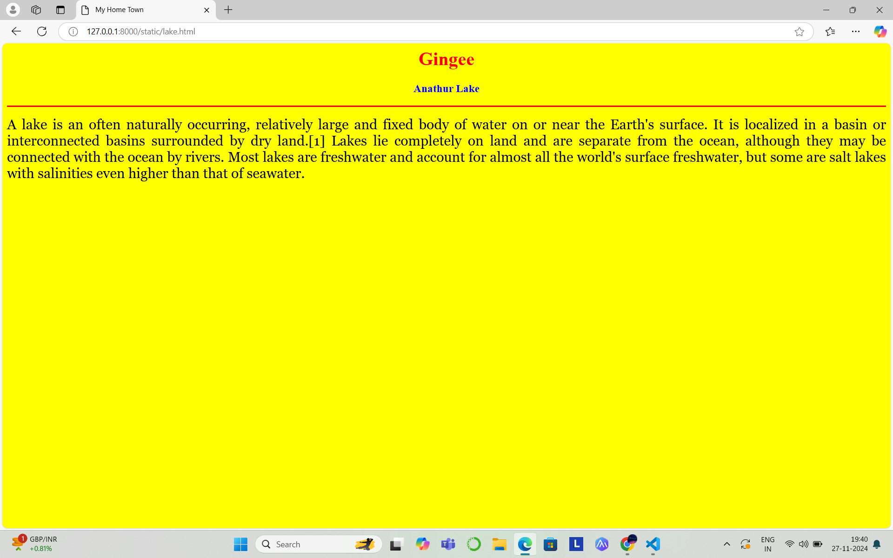

# Ex04 Places Around Me
## Date: 27.11.24

## AIM
To develop a website to display details about the places around my house.

## DESIGN STEPS

### STEP 1
Create a Django admin interface.

### STEP 2
Download your city map from Google.

### STEP 3
Using ```<map>``` tag name the map.

### STEP 4
Create clickable regions in the image using ```<area>``` tag.

### STEP 5
Write HTML programs for all the regions identified.

### STEP 6
Execute the programs and publish them.

## CODE
```
map.html
<html>
<head>
<title>My city</title>
</head>
<body>
<h1 align="center">
<font color="red">Gingee</font>
</h1>
<h3 align="center">
<font color="blue"><b>Shreya v (24000632)</b></font>
</h3>
<center>

<map name="Mycity">
<area shape="react" coords="700,250,850,400" href="home.html" title="My home town">
<area shape="circle" coords="570,230,45" href="temple.html" title="Balamurugan Temple">
<area shape="circle" coords="640,200,45" href="lake.html" title="Anathur Lake">
<area shape="circle" coords="1120,360,25" href="garden.html" title="RR Garden">
<area shape="react" coords="950,120,1100,140" href="stone.html" title="Virpattu Big Statue">
</map>
</center>
</body>
<html>

home.html
<html>
<head>
<title>My Home Town</title>
</head>
<body bgcolor="white">
<h1 align="center">
<font color="red"><b>Gingee</b></font>
</h1>
<h3 align="center">
<font color="blue"><b>Anathur - My Home Town</b></font>
</h3>
<hr size="3" color="red">
<p align="justify">
<font face="Georgia" size="5">
    Anathur is a Village in Gingee Taluka , Villupuram district and Tamil Nadu State. Anathur C.D. Block name is Vallam. Anathur village Pin code is 604202. Anathur Village Total population is 852 and number of houses are 205. Female Population is 48.8%. Village literacy rate is 70.4% and the Female Literacy rate is 30.4%.Anathur Village Gram Panchayath name is Anathur. Anathur is 7 km distance from Sub District HeadQuarter Gingee and it is 45 km distance from District HeadQuarter Viluppuram. Nearest Statutory Town is Gingee in 7 km Distance . Anathur Total area is 219.02 hectares, Non-Agricultural area is 22.75 hectares andTotal irrigated area is 29.78 hectares
</font>
</p>
</body>
</html>

temple.html
<html>
<head>
<title>My Home Town</title>
</head>
<body bgcolor="pink">
<h1 align="center">
<font color="red"><b>Gingee</b></font>
</h1>
<h3 align="center">
<font color="blue"><b>Shri Balamurugan Temple</b></font>
</h3>
<hr size="3" color="red">
<p align="justify">
<font face="Georgia" size="5">
   The temple's main deity is Lord Murugan, who is workshipped as the god of war.The temple is filled with beautiful carved pillars.The idol is riding a peacock with six faces and twelve arms.They were built as simple structures and later evolved into more elaborate and intricate architectural marvels
</font>
</p>
</body>
</html>

lake.html
<html>
<head>
<title>My Home Town</title>
</head>
<body bgcolor="yellow">
<h1 align="center">
<font color="red"><b>Gingee</b></font>
</h1>
<h3 align="center">
<font color="blue"><b>Anathur Lake</b></font>
</h3>
<hr size="3" color="red">
<p align="justify">
<font face="Georgia" size="5">
    A lake is an often naturally occurring, relatively large and fixed body of water on or near the Earth's surface. It is localized in a basin or interconnected basins surrounded by dry land.[1] Lakes lie completely on land and are separate from the ocean, although they may be connected with the ocean by rivers. Most lakes are freshwater and account for almost all the world's surface freshwater, but some are salt lakes with salinities even higher than that of seawater.
</font>
</p>
</body>
</html>

garden.html
<html>
<head>
<title>My Home Town</title>
</head>
<body bgcolor="	#AFEEEE">
<h1 align="center">
<font color="red"><b>Gingee</b></font>
</h1>
<h3 align="center">
<font color="blue"><b>RR Garden</b></font>
</h3>
<hr size="3" color="red">
<p align="justify">
<font face="Georgia" size="5">
    RR garden is a planned space, usually outdoors, set aside for the cultivation, display, and enjoyment of plants and other forms of nature. The single feature identifying even the wildest wild garden is control. The garden can incorporate both natural and artificial materials.
</font>
</p>
</body>
</html>

stone.html
<html>
<head>
<title>My Home Town</title>
</head>
<body bgcolor="	#FFA500">
<h1 align="center">
<font color="red"><b>Gingee</b></font>
</h1>
<h3 align="center">
<font color="blue"><b>Virpattu Big Statue</b></font>
</h3>
<hr size="3" color="red">
<p align="justify">
<font face="Georgia" size="5">
    The granitic rocks in the are were formed towards the end of the Archean Era. Viluppuram and Gingee are the district and sub-district headquarters of virpattu village respectively. Gingee is nearest town to virpattu for all major economic activities, which is approximately 5 km away.
</font>
</p>
</body>
</html>
```

## OUTPUT





## RESULT
The program for implementing image maps using HTML is executed successfully.
